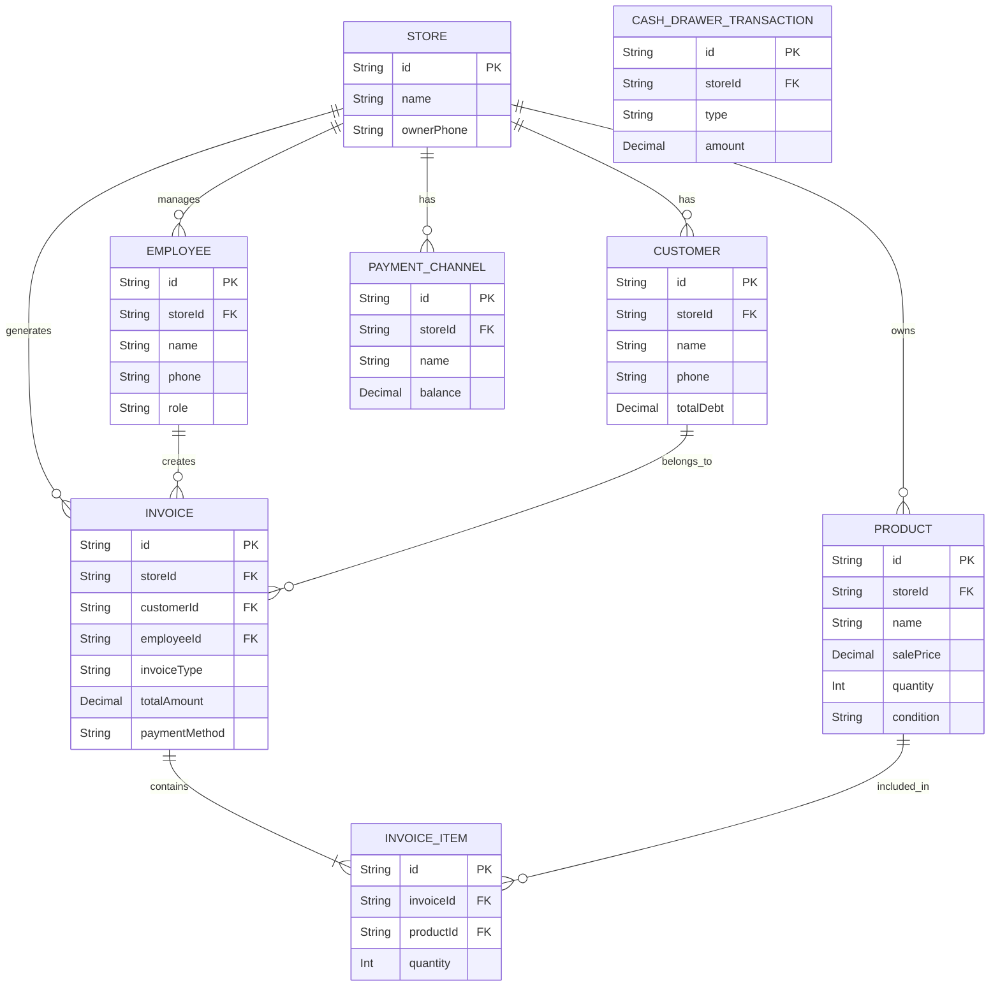

# Yoyo Store Backend

This is the backend API for Yoyo Store (POS & Store Management System), built with NestJS and Prisma.

## Database Schema (ERD)

Here is the visual representation of our database tables and their relationships:

## How to Test (For Testers)

1. Clone this repository to your local machine.
2. Run `npm install` to install dependencies.
3. Ask the developer for the `.env` file (which contains the `DATABASE_URL` and `JWT_SECRET`) and place it in the root folder.
4. Run `npm run start:dev` to start the server.
5. Open `http://localhost:3000/api-docs` in your browser to access the Swagger UI and test the endpoints.
